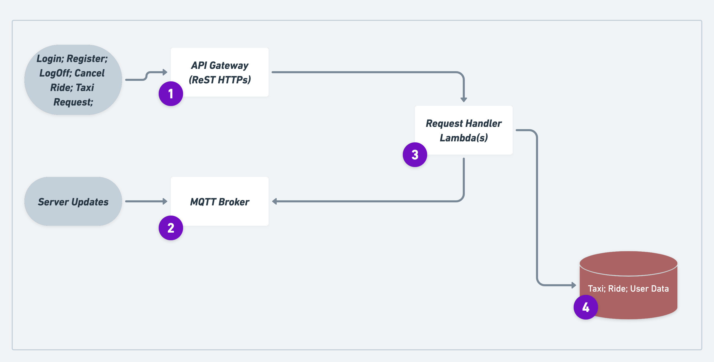
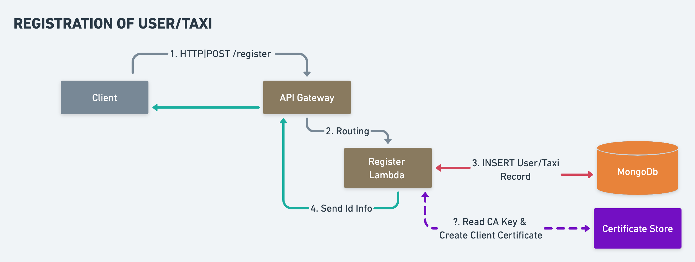
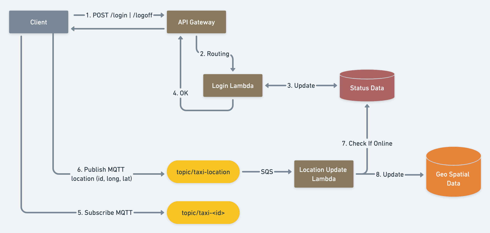
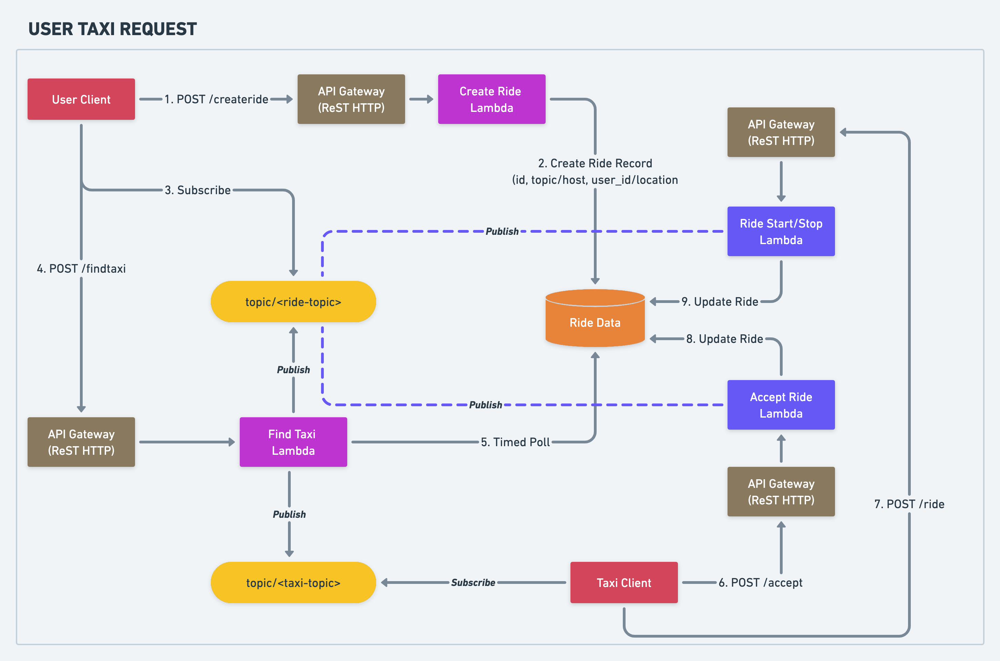

:toc:

== Envelope Calculations Per Cluster

* Taxi
    - Number of Taxi Registered: 200,000
    - Number of Shifts: `3x16` Hours each
    - Active Taxis Average: 2/3 x N = `130,000`
    - Location Updates: 130,000/m = 130,000/60/second ~= `2100/sec`

* Users
    - Number of registered users: 10,00,000
    - Peak Query: N/10 = 1,00,000/1 hour = 27.77/s ~= `30/sec`
    - Average Load: N/10 = 1,00,000/day ~ `2/second`
    - SLA Average Load: Taxi lookup under 60 seconds
    - SLA Peak Load: Taxi Lookup under 120 seconds

== Architecture Designs

{nbsp}

There are three actors in whole project representing three real world entities.

1. _Server_: Cloud based application which handles all the business logic
2. _Taxi_: A client that represents a taxi for hire. A registered taxi can receive pick up request nearby
3. _User_: A client that represents a person who wants to hire a taxi for travel. A registered user can ask for an
   available taxi nearby

There are two distinct categories of communication between clients (user/taxi) and server.

1. *_Synchronous Requests_*: These are requests by clients which requires immediate responses with blocking I/O. Example
   of such requests are _login_, _logout_, _cancel_taxi_, _register_ and so on. Since these are less frequently used, it
   makes sense to use simple _Client-Server_ Communication model here. A `ReST` Api over HTTPs is a good fit for these
   requests.
2. *_Long Term Continuous Communication_*: These are data exchanges which are extended over long time and are frequent
   in nature. Message Queueing protocol `MQTT` based endpoint can serve data transfer between client and server for
   these requests. Example data transfer could be _location update_ sent by taxi, _new user request_ assigned to a taxi,
   _changes in ongoing ride_, _cancellation of a ride by user_ and so on.
{nbsp}

=== `High Level Organization`

Below are the components that are used in the system design for serving different purposes. The components are numbered
and are explained in natural order of the numbering.

1. *API Gateway (ReST):* A HTTP endpoint that serves the synchronous requests to register a user or taxi in the system.
   Requests are forwarded to a Lambda which internal does the required validations and creates a new entry in database.
2. *MQTT Broker(s):* These MQTT brokers are exposed over internet. Each topic allows pub/sub based communication from
   server to clients. Since MQTT are efficient in keeping long connections with minimal overhead, it provides an
   excellent mechanism to allow clients to read async communication from server. Since MQTT Brokers can be scaled,
   design has been keep simple to be able to use multiple clusters if needed.
3. *Lambda Functions:* Used to perform logic on the request incoming from taxi or user
4. *GeoSpatial Capable Database:* Houses data for whole system. It can be a DB or Persistent Cache that supports
   GeoSpatial queries. Possible candidates are MongoDb, ElastiCache or Redis Cache

{nbsp}

=== `API: User/Taxi Registration`

A user and taxi needs to be registered within the system to be able to use the service. In effect, _registration_ Api
becomes the first interaction of user with the system. The flow goes like below

 1. User/Taxi makes a `HTTP POST` call to `/register` Api with JSON payload. Payload contains specific information
    about a new user or taxi. Request is recieved by API Gateway and is routed to a _register lambda_ function
 2. Register Lambda function does the validation and creates a record in database. It also generates a random _secret_
   for each profile which provides security via `JWT`
 3. A success response is sent back with assigned `id` and a `secret`

On a _success_ response client is supposed to persist the data locally along with the assigned `Id`.

=== `API: Taxi Login`

Once a taxi successfully registers with system, it gets an `Id` and a `Token`. Using these two taxi can start or stop
getting pickup requests from system. The flow goes like below;

1. Taxi makes a `POST /login` call received by API Gateway endpoint. Then it is routed to _Login Lambda_ with below
   structure;
  - `taxi_id` as a Header `X-Taxi-Id`
  - A `HS256` based JWT token as header `X-Token`

2. Login Lambda validates the _token_ using _secret_ stored in database. A _random_ topic name is generated for this
   taxi until a _logoff_ call is made by the taxi. This _topic name_ will be used to send messages to taxi from server.
   Along with  the _topic name_, a _mqtt server host_ is also sent which represents the address for broker. This allows
   us to distribute load on multiple brokers if needed to scale
3. Taxi client reads the _mqtt host_ and _topic name_ and subscribe to the topic
4. Taxi then starts making _location update_ call to the Api Gateway using HTTPs REST calls
5. For each update call, the current Geo Location is stored in Database. This location will be used for taxi lookups

Once taxi wants to stop serving request, a `/logoff` Api call is made which is routed to a _Logoff Lambda_. Once the
request is validated, the taxi is _marked_ as `OFFLINE`. Such _offline_ taxi are not used for taxi allocation.

=== `API: Taxi Booking`

Once a user successfully registers with system, it gets an `Id` and a `Secret`. Using these two, user can start booking
taxi from system. It is a 2-Step process and the flow goes like below;

1. User makes a `POST /createride` call with below structure;
  - `user_id` as a Header `X-User-Id`
  - `jwt` as a Header `X-Token`
  - JSON Payload containing _user location_
2. Request is handled by _create ride lambda_. It generates a random, _topic name_ for the ride request, creates `ride`
   record in database containing, user id, location, topic name and status. All of these are sent back to client along
   with _mqtt broker_ address
3. Client reads the broker address and topic name from the response and subscribes to it for updates
4. Client makes an authenticated ReST `POST /findtaxi` call to make server look for taxi
5. Request is served a _find taxi lambda_ which does the heavy lifting in below manner
  - It reads the ride data and finds the available taxis
  - It sends a ride request via a message onto _mqtt broker topic_ as saved in taxi record
  - It then does a poll on the _ride record_ to be updated by an available taxi
  - If a taxi accepts the request, a confirmation is sent to user by publishing a message onto the _ride topic_
  - If no taxi accepts the request, a confirmation is sent after a timeout of 2 minutes
6. An available _taxi client_ will be listening on a taxi topic as assigned by the server. For a taxi request, if a taxi
   is nearby, a message will be sent with ride details onto this _taxi topic_. The taxi client will read this message
   from _mqtt topic_ and may decide to _accept_ or _reject_ the request. In any of the case it makes a _accept_ call.
   The _accept_ call is served by a Lambda which updates the client about a rejection or acceptance by a taxi. If the
   taxi is the one to accept a ride, _ride_ record is update to mark the taxi assigned and status of the record is
   updated. In the next poll, the _find taxi lambda_ will return a success in taxi allocation for the request. A
   confirmation is sent to _taxi client_ indicating that it was the first one to respond and hence it is assigned to
   the ride
7. Taxi Client then can start and then end the ride. It makes an authenticated `POST /ride` call that is served by a
   _ride lambda_. When a ride starts, ride record is updated and user client is notified via _mqtt user topic_.
   Similarly, when the taxi ends the ride, it sends a _ride update_ onto the same ReST call. The _ride lambda_ then reads
   the ride completion and then it updates the taxi status and ride status. A ride completion message is sent to the
   _mqtt user topic_ so that user client can consider a ride to be completed

== Envelope Size Estimation: Taxi

[source]
----
Taxi Mongo Record {
 "id"  : "<string:128>",
 "type": "<string:32>",
 "registered_on": <epoch:8>,
 "license_number": "<string:64>",
 "manufacturer": "<string:64>",
 "model": "<string:64>",
 "driven_by": {
   "name": "<string:256>",
   "license": "<string:256>",
   "expiry": <epoch:8>
 },
 "token": "<string:128>"
}

Taxi Location Records {
 "last_update": <epoch:8>
 "longitude": <float:8>
 "latitude": <float:8>
}

Taxi Status Record {
  "last_update": <epoch:8>
  "logout_at": <epoch:8>,
  "trip_id": <long:8>,
}
----

* Taxi
    - total=200,000; active=130,000
    - Max Record Size: 1024 Bytes (1KB)
    - Max Active Database Size: 200,000KB/ 200MB
    - Max Status Size: 32B
    - Max Cache Size: 130,000 x 32B / 4MB
    - Peak Cache Memory Size: 200,000 x 32B / 6MB

== Envelope Size Estimation: User

[source]
----
User Mongo Record {
 "id"  : "<string:128>",
 "registered_on": <epoch:8>,
 "gender": "<string:32>",
 "contact": "<string:64>",
 "address": "<string:64>",
 "name": "<string:256>",
 "token": "<string:128>"
}

User Trip Status Record {
  "last_update": <epoch:8>
  "trip_id": <long:8>,
  "taxi_id": "<string:128>"
}
----

* Users
    - Number of registered users: 1000,000
    - Cache Size Max: 200,000 * 144B/ 28MB
    - Database Size: 680B * 1M / 680MB
